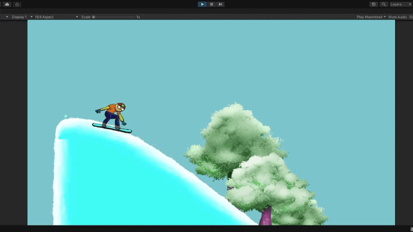
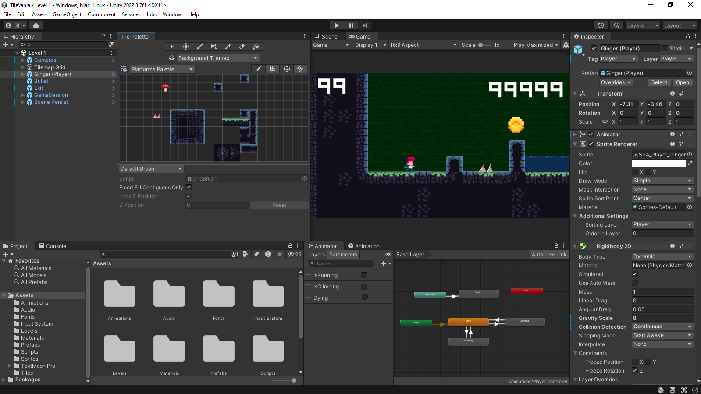

<h1 align="center">Hello 👋, I'm Santiago</h1>
<h3 align="center">A passionate software engineering student</h3>

- [CV Digital](#CV-Digital)
- [Portfolio](#Portfolio)

# CV Digital

  I have a passion for software engineering, philosophy, videogames and music. I believe what defines me as a person is my desire for knowledge, both in a professional view and for my everyday life. I always strive to improve my leadership. communication and teamworking skills.

  
• 🌱 I’m currently learning <b>Unity</b> - <b>Agile Methodologies</b> - <b>Software Architecture</b>

• 📫 How to reach me **irazoqui.santi@gmail.com**
  
  
  
  

## My Skill Set  
<table><tr><td valign="top" width="auto">

### Frontend  

  
  
  
  
  

</td><td valign="top" width="auto">

### Backend  

  
  
  
  
  
  

</td><td valign="top" width="auto">

### Databases  

  
  
  
  

</td> 
</tr>
<tr> <td valign="top" width="auto" height="100%">
  
### Big Data  

  
  
 

</td> <td valign="right" width="auto">
  
### Game Development  

  
  

  
</td>

</tr> </table>  

   

<h3 align="left">Connect with me:</h3>

&nbsp;

# Portfolio
## Gamedev.tv Udemy Course - Unity 2D game development
### Snow Boarder
Snow boarding game where the player needs to reach the end of the track while doind tricks. For the level layout we used sprite shapes. Some the most important lessons include using edge colliders, implementing effectors to push the player, creating particle effects with triggers, and playing around with the physics system.

### Tile Vania
2D side-scrolling platformer. The player must jump and climb to avoid obstacles and enemies (or shoot them!) in order to reach the end of the level. A level loading system is used so that the when we finish a particular level, the following one is loaded, and so on. To create the levels we used the tilemap system in Unity. Other key aspects of this game include handling animations, persisting game sessions, and State-Driven cameras.

### Laser Defender

